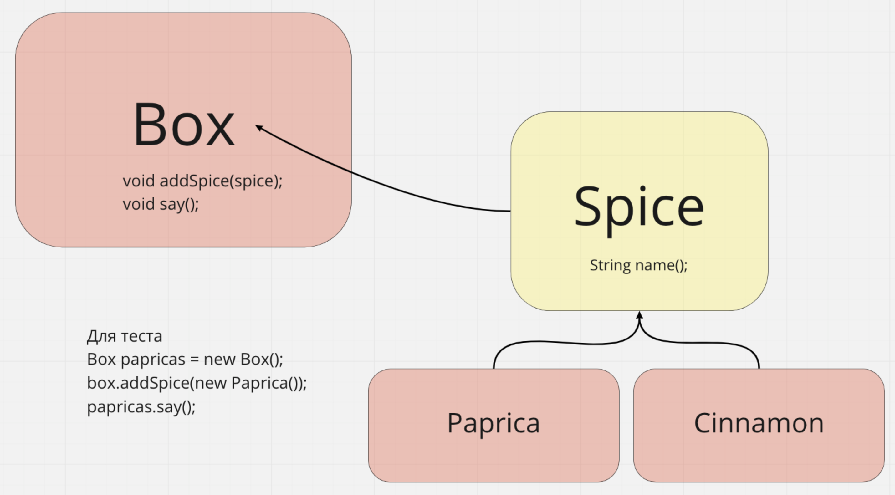

## Отработка дженериков

Репозиторий разбит на 4 уровня. От самого сложного - level1, 
где вам надо все релизовать самим, до готового решения level4.

Если не получается сделать level1, просто пробейте level2 и так далее.

Все классы сделаны package-private, чтобы идея не мешала, пытаясь
заимпортить из других пакетов.

Если будет мешать - можно просто удалить лишние пакеты.

## Описания задания

Нам нужно сделать коробку Box, которая содержит в себе специи Spice. 
Каждая специя содержит название и может отдавать его через 
соответствующий метод.
Коробка может сообщить, какие специи в ней находятся.

Например, сделайте коробку, которая содержит только паприку. 
Добавьте несколько видов паприки и выведите их все на печать.
Создайте коробку, которая содержит корицу. Точно так же 
добавьте корицы и выведите на печать.

Проверьте, что будет если попытаться в коробку с паприкой добавить корицы.

## Примерная схема
